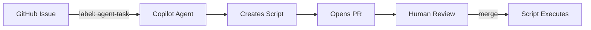

# AI Coding Automation

Automate IT support tasks using GitHub Copilot Agent. Create a GitHub issue, label it `agent-task`, and the agent generates scripts for human review.

## Quick Start

1. **Create an issue** describing the task (e.g., "Add john.doe@solita.dk to IT-Support-Team group")
2. **Add the label** `agent-task`
3. **Review the PR** the agent creates, then merge to execute

## How It Works



## Project Structure

```
├── .github/
│   ├── copilot-instructions.md   # Agent instructions
│   └── workflows/                # Automation workflows
├── scripts/
│   ├── pending/                  # Scripts awaiting approval
│   ├── executed/                 # Completed scripts
│   └── templates/                # Reusable script templates
├── agent-docs/                   # Agent-created documentation
└── docs/                         # Project documentation
```

## Documentation

- [System Architecture](docs/architecture/system.md)
- [Repository Structure](docs/architecture/repository.md)
- [Setup Guide](docs/setup.md)
- [Research Goals](docs/research.md)

## Current Focus

Simple Azure AD administrative tasks:
- Add/remove users from groups
- List group members

## License

MIT

