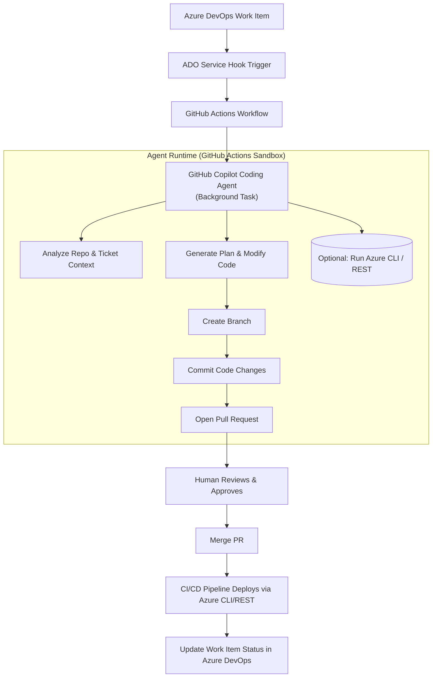

# AI-Driven Coding Automation with GitHub Copilot Agent & Azure DevOps

Automating Repeatable Engineering Tasks using GitHub Copilot Agent, Azure DevOps, Azure CLI/REST, and GitHub Actions

## ⭐ Overview

This project explores how GitHub Copilot Agent and GitHub Actions can be used to automate repetitive engineering tasks, triggered from Azure DevOps (ADO) work items and executed safely through pull requests (PRs) and Azure CLI/REST operations.

The goal is to build a prototype agentic workflow capable of:

- Understanding Azure DevOps work items
- Generating and executing background tasks with GitHub Copilot Agent
- Producing ready-to-review PRs within minutes to hours
- Executing optional Azure CLI commands in a secure environment
- Closing the loop by updating DevOps ticket status

This repository is part of a research project with DTU and Solita, studying how AI agentic workflows can automate routine tasks and reshape software development processes. The project is inspired by Solita's internal GenAI automation initiatives and production PoCs.

## 🚀 Motivation

Solita has demonstrated that AI-powered background agents can handle tasks such as:

- Library upgrades (including fixing breaking API changes)
- Automated user access workflows
- Routine configuration updates
- Low-level refactoring and hygiene tasks

These agents produce production-quality PRs in 5–15 minutes, significantly reducing manual workload and cycle time.

This project brings those capabilities into an integrated workflow using:

- Azure DevOps as the ticketing and trigger layer
- GitHub Copilot Coding Agent as the main autonomous agent
- GitHub Actions as the execution and sandbox runtime
- Azure CLI & REST for infrastructure automation

This is part of a larger paradigm shift where developers "herd" multiple tickets simultaneously while AI performs background work.

## 🏗 Architecture

Below is the full workflow from Azure DevOps → GitHub → Copilot Agent → PR → Deployment → Ticket resolution.



This architecture mirrors Solita's demonstrated workflows for Copilot Agent–driven automation.

## 🔧 Key Components

### 1. Azure DevOps Work Item Trigger

A service hook pushes work item events (created/updated) into GitHub Actions.

### 2. GitHub Actions Orchestrator

The Action:

- Parses the payload
- Creates a background Copilot Agent task
- Passes context (ticket text, repo info, instructions)
- Provides a sandbox environment for optional Azure CLI commands

### 3. GitHub Copilot Coding Agent

The coding agent:

- Reads repo context
- Understands the Azure DevOps ticket
- Plans and performs code changes
- Runs commands/tests in a secure action runtime
- Creates a PR with explanations and commit messages

These capabilities match Solita's findings: the agent can autonomously update dependencies, fix breaking API changes, adjust code, and produce review-ready PRs.

### 4. Optional: Azure CLI / REST Execution

The agent may execute safe exploratory commands (e.g., listing resources) in its sandbox.

Infrastructure-changing commands are normally executed only via CI/CD after PR approval (safety best-practice).

### 5. Human Review

A human developer reviews and approves the PR.

### 6. CI/CD Deployment

After merge:

- GitHub Actions applies IaC or scripts
- Azure CLI / REST modifies actual cloud state
- The Azure DevOps work item is updated automatically

## 📦 Example Use Cases

### Automated Library Updates

- Detect outdated dependencies
- Upgrade them
- Fix breaking API changes
- Produce PR with full explanation

Already demonstrated in Solita PoCs.

### Azure Resource Changes

- Update Bicep/Terraform
- Modify Azure DevOps pipeline YAML
- Produce scripts to run az commands
- Apply changes after PR approval

### Routine IT/DevOps Tasks

- Update budgets
- Modify access rights (PR-first pattern)
- Standardized configuration changes

- Update documentation
- Update knowledge base
- Update FAQ
- Update user guide
- Update training materials
- Update support articles
- Update support documentation
- Update support knowledge base
- Update support FAQ
- Update support user guide
- Update support training materials

## 🧭 Roadmap

### Phase 1 — Foundations (MVP)

- [x] Connect Azure DevOps service hook → GitHub Action
- [ ] Prepare a GitHub Action that creates a Copilot Agent task
- [ ] Provide ticket text + instructions to the agent
- [ ] Agent produces branch + PR
- [ ] Pipeline updates ADO ticket after merge

- [ ] Ticket and Documentation RAG vector store for agent to query for context
- [ ] Retrieval-Augmented Generation (RAG) for agent to query for context

### Phase 2 — Azure Integration

- [ ] A Completely Isolated Azure Sub-Tenant (for research and testing)

- [ ] Add Azure CLI inside the action sandbox
- [ ] Allow safe read-only commands by the agent
- [ ] Implement PR-first Azure IaC changes
- [ ] Add deployment job triggered by merge

### Phase 3 — Advanced Agentic Behaviors

- [ ] Multi-ticket parallel processing ("herding cattle")
- [ ] Evaluate multiple LLM models (e.g. Sonnet 4.5 vs GPT-4.1)
- [ ] Optional: Custom agent loop for comparison
- [ ] Add RAG over internal documentation
- [ ] Add real-time ticket triage and classification

### Phase 4 — Research & Evaluation

- [ ] Evaluate on historical Solita tickets
- [ ] Compare human vs. agent speed and correctness
- [ ] Assess reliability, failure modes, and trustworthiness
- [ ] Prepare academic results

---

## 🔍 Access Checklist

### GitHub

- [ ] Repo write access
- [ ] Copilot Business license
- [ ] Copilot Agent features enabled
- [ ] GitHub Actions permissions
- [ ] Ability to open PRs programmatically

### Azure DevOps

- [ ] Access to work items
- [ ] Permission to create service hooks
- [ ] Read/write on Boards

### Azure

- [ ] Sandbox subscription
- [ ] SP/OIDC identity for GH Actions
- [ ] Reader/Contributor access

### Security

- [ ] Approval for agent automation
- [ ] Approval to use internal tickets

### Data
 - [ ] Access to historical ADO tickets
 - [ ] Documentation on existing workflows

## 📁 Repository Structure (Suggested)

```
/.github/workflows/
    agent-trigger.yml     # Creates Copilot agent task
    deploy.yml            # Applies Azure changes on merge

/scripts/
    azure_helpers.sh      # CLI helpers for agent or pipeline
    ado_webhook_parser.py # Parse Azure DevOps payloads

/agents/
    prompts/
        ticket_prompt.md  # Instructions given to Copilot Agent
    examples/
        library_update/   # Example triggers and outputs

/docs/
    architecture.md
    evaluation_plan.md
    roadmap.md
```

## 🔬 Research Questions (for DTU Thesis Integration)

- How effective is GitHub Copilot Agent in automating real-world DevOps tasks?
- Which tasks are most reliably automated?
- How do models differ (Claude Sonnet 4.5 vs GPT-4.1) for task automation?
- What are the safety implications of allowing agents to run CLI commands?
- What is the optimal balance between autonomy and human-in-the-loop validation?

## 🛡 Safety & Constraints

- All destructive Azure actions MUST be gated behind PR review
- Agent CLI usage allowed only in sandbox
- Follow Solita's internal guidelines for enabling Copilot Agent CLI org-wide
- Monitor agent output for hallucinations or incorrect assumptions

## 🤝 Contributors

**Solita Contacts (from slides)**

- Mads Jønsson - Main Author

- Michael Sundgaard - Initial Demo
- Solita Finland - AI Coding Automation Slides

## 📄 License

MIT (or your preferred license)
