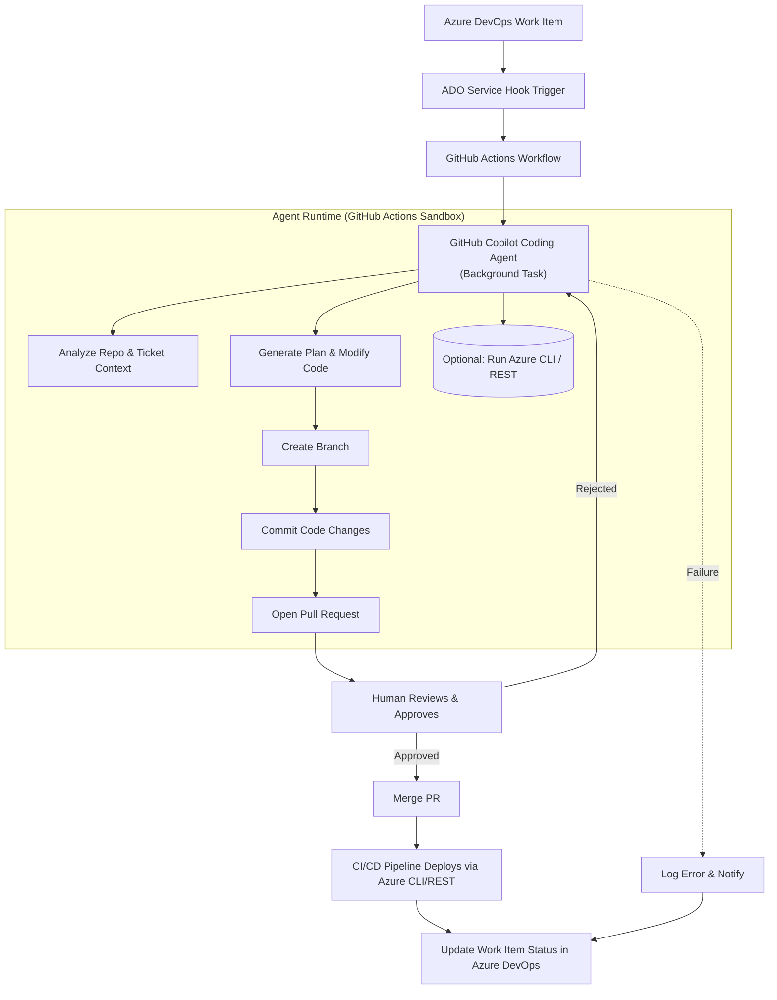

# AI-Driven Coding Automation with GitHub Copilot Agent & Azure DevOps


Automating Repeatable Engineering Tasks using GitHub Copilot Agent, Azure DevOps, Azure CLI/REST, and GitHub Actions

## ⭐ Overview

This project explores how GitHub Copilot Agent and GitHub Actions can be used to automate repetitive engineering tasks, triggered from Azure DevOps (ADO) work items and executed safely through pull requests (PRs) and Azure CLI/REST operations.

The goal is to build a prototype agentic workflow capable of:

- Understanding Azure DevOps work items
- Generating and executing background tasks with GitHub Copilot Agent
- Producing ready-to-review PRs within minutes to hours
- Executing optional Azure CLI commands in a secure environment
- Closing the loop by updating DevOps ticket status

This repository is part of a research project with DTU and Solita, studying how AI agentic workflows can automate routine tasks and reshape software development processes. The project is inspired by Solita's internal GenAI automation initiatives and production PoCs.

## 📋 Prerequisites

Before getting started, ensure you have:

- **GitHub Copilot Business** license with Agent features enabled
- **Azure DevOps** organization access with work item permissions
- **Azure subscription** (sandbox environment recommended)
- **GitHub Actions** permissions to run workflows
- **Python 3.9+** or **Node.js 18+** (for scripting)
- Service Principal or OIDC identity for Azure authentication

## 🚀 Quick Start

1. **Clone the repository**

```bash
git clone https://github.com/your-org/coding-automation-demo.git
cd coding-automation-demo
```

2. **Configure Azure DevOps Service Hook**
   - Navigate to Project Settings → Service Hooks
   - Create new webhook pointing to GitHub Actions
   - Select work item events (created/updated)

3. **Set up GitHub Secrets**

```bash
# Required secrets in GitHub repository settings
AZURE_DEVOPS_PAT
AZURE_CLIENT_ID
AZURE_CLIENT_SECRET
AZURE_TENANT_ID
AZURE_SUBSCRIPTION_ID
```

4. **Test with a sample work item**
   - Create a test work item in Azure DevOps
   - Watch the GitHub Action trigger
   - Review the generated PR

## 🚀 Motivation

Solita has demonstrated that AI-powered background agents can handle tasks such as:

- Library upgrades (including fixing breaking API changes)
- Automated user access workflows
- Routine configuration updates
- Low-level refactoring and hygiene tasks

These agents produce production-quality PRs in 5–15 minutes, significantly reducing manual workload and cycle time.

This project brings those capabilities into an integrated workflow using:

- Azure DevOps as the ticketing and trigger layer
- GitHub Copilot Coding Agent as the main autonomous agent
- GitHub Actions as the execution and sandbox runtime
- Azure CLI & REST for infrastructure automation

This is part of a larger paradigm shift where developers "herd" multiple tickets simultaneously while AI performs background work.

## 🏗 Architecture

Below is the full workflow from Azure DevOps → GitHub → Copilot Agent → PR → Deployment → Ticket resolution.



This architecture mirrors Solita's demonstrated workflows for Copilot Agent–driven automation.

## 🔧 Key Components

### 1. Azure DevOps Work Item Trigger

A service hook pushes work item events (created/updated) into GitHub Actions.

### 2. GitHub Actions Orchestrator

The Action:

- Parses the payload
- Creates a background Copilot Agent task
- Passes context (ticket text, repo info, instructions)
- Provides a sandbox environment for optional Azure CLI commands

### 3. GitHub Copilot Coding Agent

The coding agent:

- Reads repo context
- Understands the Azure DevOps ticket
- Plans and performs code changes
- Runs commands/tests in a secure action runtime
- Creates a PR with explanations and commit messages

These capabilities match Solita's findings: the agent can autonomously update dependencies, fix breaking API changes, adjust code, and produce review-ready PRs.

### 4. Optional: Azure CLI / REST Execution

The agent may execute safe exploratory commands (e.g., listing resources) in its sandbox.

Infrastructure-changing commands are normally executed only via CI/CD after PR approval (safety best-practice).

### 5. Human Review

A human developer reviews and approves the PR.

### 6. CI/CD Deployment

After merge:

- GitHub Actions applies IaC or scripts
- Azure CLI / REST modifies actual cloud state
- The Azure DevOps work item is updated automatically

## ⚙️ Configuration

### Required Secrets

Configure these secrets in GitHub repository settings:

| Secret | Description | Example |
|--------|-------------|---------|
| `AZURE_DEVOPS_PAT` | Personal Access Token for ADO | `xxxxxxxxxx` |
| `AZURE_CLIENT_ID` | Service Principal Client ID | `00000000-0000-0000-0000-000000000000` |
| `AZURE_CLIENT_SECRET` | Service Principal Secret | `xxxxxxxxxx` |
| `AZURE_TENANT_ID` | Azure AD Tenant ID | `00000000-0000-0000-0000-000000000000` |
| `AZURE_SUBSCRIPTION_ID` | Azure Subscription ID | `00000000-0000-0000-0000-000000000000` |
| `GITHUB_TOKEN` | GitHub PAT with repo access | Auto-provided by GitHub Actions |

### Environment Variables

Create a `.env` file based on `.env.example`:

```bash
# See .env.example for all configuration options
AGENT_MAX_TASKS_PER_HOUR=10
AGENT_TIMEOUT_MINUTES=30
LOG_LEVEL=INFO
```

## 📦 Example Use Cases

### Automated Library Updates

- Detect outdated dependencies
- Upgrade them
- Fix breaking API changes
- Produce PR with full explanation

Already demonstrated in Solita PoCs.

### Azure Resource Changes

- Update Bicep/Terraform
- Modify Azure DevOps pipeline YAML
- Produce scripts to run az commands
- Apply changes after PR approval

### Routine IT/DevOps Tasks

- Update budgets
- Modify access rights (PR-first pattern)
- Standardized configuration changes
- Documentation updates (knowledge base, FAQs, user guides, training materials)

## 🧭 Roadmap

### Phase 1 — Foundations (MVP)

- [x] Connect Azure DevOps service hook → GitHub Action
- [ ] Prepare a GitHub Action that creates a Copilot Agent task
- [ ] Provide ticket text + instructions to the agent
- [ ] Agent produces branch + PR
- [ ] Pipeline updates ADO ticket after merge
- [ ] Build RAG vector store for tickets and documentation to provide context to the agent

### Phase 2 — Azure Integration

- [ ] Provision a completely isolated Azure sub-tenant for research and testing
- [ ] Add Azure CLI inside the action sandbox
- [ ] Allow safe read-only commands by the agent
- [ ] Implement PR-first Azure IaC changes
- [ ] Add deployment job triggered by merge

### Phase 3 — Advanced Agentic Behaviors

- [ ] Multi-ticket parallel processing ("herding cattle")
- [ ] Evaluate multiple LLM models (e.g. Sonnet 4.5 vs GPT-4.1)
- [ ] Optional: Custom agent loop for comparison
- [ ] Add RAG over internal documentation
- [ ] Add real-time ticket triage and classification

### Phase 4 — Research & Evaluation

- [ ] Evaluate on historical Solita tickets
- [ ] Compare human vs. agent speed and correctness
- [ ] Assess reliability, failure modes, and trustworthiness
- [ ] Prepare academic results

The Solita slides emphasize urgency: this technology is already operational and brings immediate productivity gains; organizations should act now, not "sometime later."

---

## 📊 Evaluation Metrics

The research project will track the following key performance indicators:

### Success Metrics

- **Success Rate**: Percentage of tickets successfully automated end-to-end
- **Time to PR**: Average time from ticket creation to PR submission
- **PR Quality Score**: Based on code review feedback and revision counts
- **Merge Rate**: Percentage of agent-generated PRs that get merged
- **Time Savings**: Hours saved compared to manual implementation

### Cost Metrics

- **Cost per Task**: Total cost (compute + API calls) / number of tasks automated
- **ROI**: Time saved (hours × hourly rate) vs. total system cost
- **Token Usage**: Average tokens consumed per ticket type

### Reliability Metrics

- **Failure Rate**: Percentage of tasks that fail completely
- **Retry Rate**: Percentage of tasks requiring agent refinement
- **False Positive Rate**: Tasks marked complete but requiring human fixes

## 🔬 Research Methodology

### Evaluation Approach

1. **Baseline Measurement** (Week 1-2)
   - Document current manual process for target task types
   - Measure time, cost, and error rates
   - Establish quality benchmarks

2. **Intervention** (Week 3-8)
   - Deploy agent system
   - Process tickets through automated workflow
   - Collect metrics on all automated tasks

3. **Comparison & Analysis** (Week 9-10)
   - Compare automated vs. baseline metrics
   - Identify patterns in success/failure cases
   - Analyze task characteristics that predict success

4. **Iteration** (Ongoing)
   - Refine prompts and agent instructions
   - Expand task type coverage
   - Improve error handling

### Data Collection

- All agent interactions logged to structured format
- PR metadata (time, size, review comments) tracked
- Survey developers on satisfaction and trust
- Code quality metrics (test coverage, linting, complexity)

## 🔬 Research Questions (for DTU Thesis Integration)

- How effective is GitHub Copilot Agent in automating real-world DevOps tasks?
- Which tasks are most reliably automated?
- How do models differ (Claude Sonnet 4.5 vs GPT-4.1) for task automation?
- What are the safety implications of allowing agents to run CLI commands?
- What is the optimal balance between autonomy and human-in-the-loop validation?
- How does RAG integration impact agent success rates?
- What ticket characteristics predict automation success?

## ⚠️ Limitations

### Current Limitations

- **Scope**: Limited to predefined ticket types with structured descriptions
- **Edge Cases**: May not handle unusual or complex scenarios without human intervention
- **Context Window**: Large codebases may exceed agent context limits
- **Cost**: Token usage costs may be prohibitive for high-volume, low-value tasks
- **Accuracy**: Occasional hallucinations or incorrect assumptions require human review
- **Security**: Sensitive operations still require manual approval

### Known Issues

- Service hook may experience delays during Azure DevOps outages
- Large PRs (>100 files) may timeout
- Complex dependency conflicts may require manual resolution
- Agent may struggle with poorly documented codebases

### Future Work

- Expand to additional ticket types beyond current scope
- Implement feedback loop for continuous agent improvement
- Add support for multi-repository changes
- Integrate with additional ticketing systems (Jira, Linear)

## 🔍 Access Checklist

### GitHub

- [ ] Repo write access
- [ ] Copilot Business license
- [ ] Copilot Agent features enabled
- [ ] GitHub Actions permissions
- [ ] Ability to open PRs programmatically

### Azure DevOps

- [ ] Access to work items
- [ ] Permission to create service hooks
- [ ] Read/write on Boards

### Azure

- [ ] Sandbox subscription
- [ ] SP/OIDC identity for GH Actions
- [ ] Reader/Contributor access

### Security

- [ ] Approval for agent automation
- [ ] Approval to use internal tickets

### Data

- [ ] Access to historical ADO tickets
- [ ] Documentation on existing workflows

## 📁 Repository Structure

```
/
├── .github/
│   └── workflows/
│       ├── agent-trigger.yml      # Creates Copilot agent task
│       ├── deploy.yml             # Applies Azure changes on merge
│       └── test.yml               # CI/CD testing
│
├── scripts/
│   ├── azure_helpers.sh           # CLI helpers for agent or pipeline
│   ├── ado_webhook_parser.py     # Parse Azure DevOps payloads
│   └── create_service_hook.py    # Setup script for ADO webhook
│
├── agents/
│   ├── prompts/
│   │   ├── ticket_prompt.md      # Instructions given to Copilot Agent
│   │   ├── library_update.md     # Specialized prompt for upgrades
│   │   └── azure_changes.md      # Specialized prompt for IaC
│   └── examples/
│       ├── library_update/       # Example triggers and outputs
│       ├── azure_resource/       # Azure IaC examples
│       └── documentation/        # Documentation update examples
│
├── tests/
│   ├── test_webhook_parser.py    # Unit tests
│   ├── test_azure_helpers.sh     # Shell script tests
│   └── fixtures/
│       └── sample_work_item.json # Test data
│
├── docs/
│   ├── architecture.md           # Detailed architecture docs
│   ├── evaluation_plan.md        # Research evaluation plan
│   ├── setup_guide.md            # Step-by-step setup
│   └── troubleshooting.md        # Common issues and solutions
│
├── .env.example                   # Environment variables template
├── .gitignore
├── CONTRIBUTING.md               # Contribution guidelines
├── LICENSE
└── README.md                     # This file
```

## 🛡 Safety & Constraints

### Security Measures

- **PR Review Required**: All destructive Azure actions MUST be gated behind PR review
- **Sandbox Isolation**: Agent CLI usage allowed only in isolated GitHub Actions sandbox
- **Command Allowlist**: Azure CLI commands require explicit allowlist configuration
- **Audit Logging**: All agent actions logged with full traceability
- **Secret Management**: All credentials stored in GitHub Secrets, never in code
- **Least Privilege**: Service principals configured with minimum required permissions

### Agent Guidelines

- Follow Solita's internal guidelines for enabling Copilot Agent CLI org-wide
- Monitor agent output for hallucinations or incorrect assumptions
- Implement rate limiting to prevent runaway costs
- Require human approval for high-risk operations
- Maintain rollback capability for all automated changes

### Rate Limiting

- Maximum 10 agent tasks per hour (configurable)
- Queue system for high-volume periods
- Cost alerts at 80% of monthly budget
- Automatic pause if error rate exceeds 50%

## 🔧 Troubleshooting

### Common Issues

#### Service Hook Not Triggering

**Problem**: Work items created in Azure DevOps don't trigger GitHub Actions

**Solutions**:
- Verify webhook URL is correct in ADO Service Hooks settings
- Check that `AZURE_DEVOPS_PAT` has proper permissions
- Review GitHub Actions logs for authentication errors
- Ensure firewall rules allow ADO webhooks

#### Agent Task Fails

**Problem**: Copilot Agent task fails without creating PR

**Solutions**:
- Review GitHub Actions logs for error messages
- Check Copilot Agent quota and permissions
- Verify ticket description follows expected format
- Increase timeout if task is timing out

#### PR Not Created

**Problem**: Agent completes but no PR appears

**Solutions**:
- Verify `GITHUB_TOKEN` has `repo` and `pull_request` scopes
- Check branch protection rules aren't blocking PR creation
- Review agent logs for commit/push errors
- Ensure work item type is supported

#### Azure CLI Commands Fail

**Problem**: Azure CLI operations return authentication errors

**Solutions**:
- Verify Service Principal credentials in GitHub Secrets
- Check SP has required RBAC roles on target subscription
- Ensure Azure CLI is logged in within the action
- Review command allowlist configuration

### Getting Help

- Check the [docs/troubleshooting.md](docs/troubleshooting.md) for detailed solutions
- Review GitHub Actions logs for error details
- Open an issue with error logs and work item details
- Contact project maintainers

## 💰 Cost Considerations

### Estimated Costs

| Component | Cost | Notes |
|-----------|------|-------|
| GitHub Copilot Business | $19-39/user/month | Per developer seat |
| GitHub Actions | ~$0.008/minute | Linux runners, varies by usage |
| Azure CLI Operations | Variable | Depends on resources created |
| Vector Store (if using managed) | ~$0.20/GB/month | For RAG implementation |
| LLM API Calls (if using external) | ~$0.01-0.10/task | Depends on model and tokens |

### Cost Optimization Tips

- Use self-hosted runners for GitHub Actions to reduce compute costs
- Implement caching to minimize redundant operations
- Set strict rate limits and budgets
- Use smaller/cheaper models for simple tasks
- Monitor token usage and optimize prompts

### ROI Calculation

```
Example: Library Update Task
- Manual time: 2 hours @ $100/hr = $200
- Agent cost: $0.50 (compute + API)
- Net savings: $199.50 per task
- Break-even: 1-2 automated tasks
```

## 📖 Glossary

- **ADO**: Azure DevOps - Microsoft's DevOps platform
- **IaC**: Infrastructure as Code - Managing infrastructure through code
- **PR**: Pull Request - Code review mechanism in Git
- **RAG**: Retrieval-Augmented Generation - AI technique using external knowledge
- **SP**: Service Principal - Azure identity for applications
- **OIDC**: OpenID Connect - Authentication protocol
- **LLM**: Large Language Model - AI models like GPT-4 or Claude
- **PoC**: Proof of Concept - Experimental implementation
- **PAT**: Personal Access Token - Authentication token

## ❓ FAQ

**Q: How long does it take for the agent to create a PR?**
A: Typically 5-15 minutes for simple tasks, up to 1 hour for complex changes.

**Q: What happens if the agent makes a mistake?**
A: All changes go through PR review. Human reviewers can request changes or reject the PR.

**Q: Can I use this with Jira instead of Azure DevOps?**
A: Not currently, but this is planned for future releases. See the Roadmap.

**Q: Is my code/data secure?**
A: Yes. The agent runs in an isolated sandbox, and all credentials are managed through GitHub Secrets. See Security & Constraints section.

**Q: What types of tasks work best?**
A: Repetitive, well-defined tasks like dependency updates, configuration changes, and documentation updates. See Example Use Cases.

**Q: How much does this cost to run?**
A: Highly variable depending on usage. See Cost Considerations section for estimates.

## 📚 Additional Resources

- [GitHub Copilot Agent Documentation](https://docs.github.com/copilot)
- [Azure DevOps Service Hooks](https://docs.microsoft.com/azure/devops/service-hooks/)
- [Solita GenAI Case Studies](https://www.solita.fi/) (if publicly available)
- [DTU Research Project](link-to-thesis-when-available)

## 🤝 Contributors

**Solita Contacts (from slides)**

- Mads Jønsson - Main Author & Research Lead
- Michael Sundgaard - Initial Demo & PoC Development
- Solita Finland - AI Coding Automation Research

## 🙏 Acknowledgments

This project is built on research and production experience from:

- Solita's GenAI Lab and internal automation initiatives
- DTU (Technical University of Denmark) research collaboration
- GitHub Copilot Agent team
- The broader AI/DevOps automation community

## 📄 License

MIT License - See [LICENSE](LICENSE) file for details

---

**Note**: This is a research project. Use in production environments should follow your organization's security and compliance requirements.
