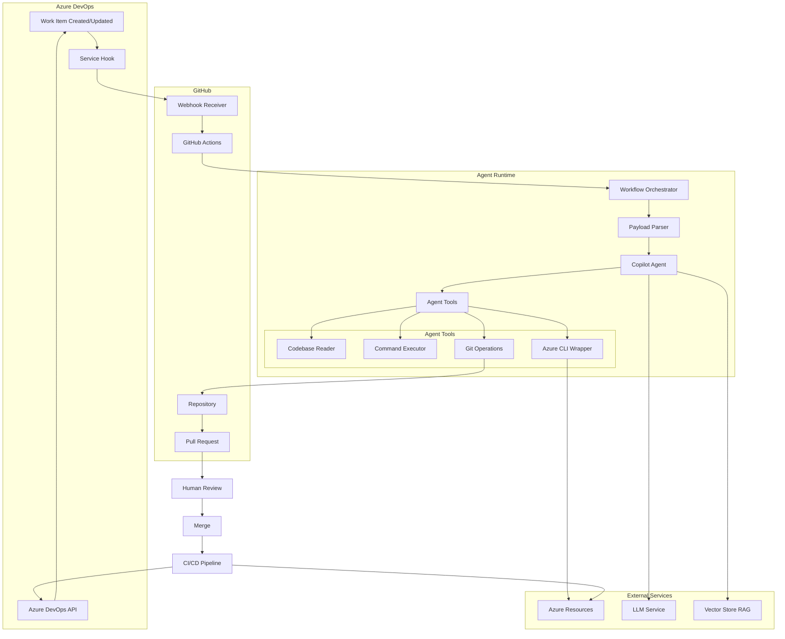
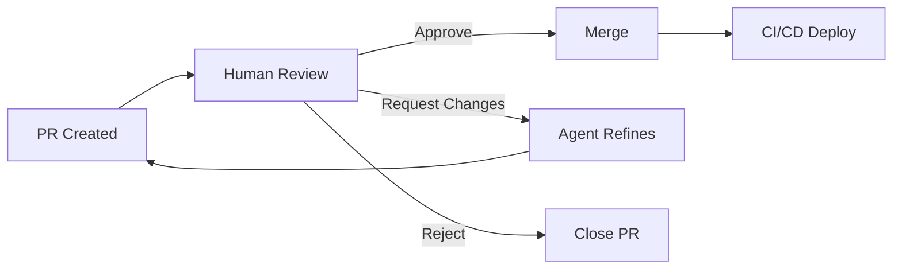
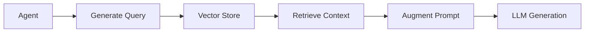

# Architecture Documentation

Detailed technical architecture of the AI-Driven Coding Automation system.

## System Overview

This system enables autonomous code changes triggered by Azure DevOps work items, executed by GitHub Copilot Agent, and merged through human-reviewed pull requests.

## Architecture Diagram



## Component Details

### 1. Azure DevOps Layer

#### Work Item Management

- **Work Items**: Tasks, Bugs, User Stories that trigger automation
- **Service Hooks**: Webhooks that fire on work item events
- **Azure Boards API**: Used to update work item status after completion

**Event Flow:**

```
Work Item Created → Service Hook Triggered → Webhook POST to GitHub
```

**Payload Structure:**

```json
{
  "eventType": "workitem.created",
  "resource": {
    "id": 12345,
    "fields": {
      "System.Title": "Upgrade React to v18",
      "System.Description": "<html>...</html>",
      "System.WorkItemType": "Task",
      "System.Tags": "automation;frontend"
    }
  }
}
```

### 2. GitHub Actions Orchestrator

#### Workflow Trigger

```yaml
on:
  repository_dispatch:
    types: [azure-devops-work-item]
```

#### Responsibilities

1. **Receive webhook** from Azure DevOps
2. **Parse payload** and extract work item details
3. **Validate** work item is suitable for automation
4. **Invoke agent** with proper context
5. **Handle errors** and notify stakeholders

#### Environment Setup

```yaml
- name: Setup environment
  run: |
    # Install dependencies
    # Configure Azure CLI
    # Setup Git credentials
    # Load agent prompts
```

### 3. GitHub Copilot Agent

#### Agent Invocation

The agent receives:
- Work item description
- Repository context
- Agent instructions (prompt)
- Available tools

#### Agent Loop

```
1. Analyze work item → Understand requirements
2. Explore codebase → Identify relevant files
3. Plan changes → Generate implementation strategy
4. Execute changes → Modify code
5. Validate → Run tests
6. Create PR → Package changes with description
```

#### Tools Available to Agent

| Tool | Purpose | Safety Level |
|------|---------|--------------|
| `read_file` | Read source code | ✅ Safe |
| `write_file` | Modify source code | ⚠️ Sandboxed |
| `run_command` | Execute shell commands | ⚠️ Allowlist only |
| `azure_cli` | Azure operations | ⚠️ Read-only in sandbox |
| `search_codebase` | Find relevant code | ✅ Safe |
| `create_pr` | Generate pull request | ✅ Safe |

### 4. Safety Sandbox

All agent operations run in an isolated environment:

```yaml
runs-on: ubuntu-latest  # Ephemeral GitHub Actions runner
permissions:
  contents: write       # Limited to repository
  pull-requests: write
```

**Isolation Features:**

- Ephemeral runner (destroyed after job)
- Network isolation from production
- Limited Azure permissions (read-only for exploratory)
- Command allowlisting
- No access to production secrets

### 5. Pull Request Workflow

#### PR Creation

Agent creates PR with:
- Branch: `work-item-{id}`
- Title: `[Work Item #12345] Brief description`
- Description: Detailed change summary
- Labels: Auto-tagged based on work item type
- Reviewers: Assigned based on CODEOWNERS

#### Human Review



### 6. CI/CD Deployment

After PR merge:

```yaml
on:
  push:
    branches: [main]

jobs:
  deploy:
    runs-on: ubuntu-latest
    steps:
      - name: Deploy infrastructure
        run: |
          az deployment group create \
            --template-file infrastructure/main.bicep
      
      - name: Update work item
        run: |
          # Call Azure DevOps API to mark work item complete
```

## Data Flow

### 1. Work Item → Agent

```
Azure DevOps Work Item
  ↓ (Service Hook)
GitHub Webhook
  ↓ (repository_dispatch)
GitHub Actions Workflow
  ↓ (Parse payload)
Work Item Context Object
  ↓ (Render prompt template)
Agent Prompt + Instructions
  ↓ (Agent invocation)
Copilot Agent Task
```

### 2. Agent → PR

```
Agent Analyzes Task
  ↓ (Tools: read, search)
Agent Plans Implementation
  ↓ (Tools: write, execute)
Agent Makes Changes
  ↓ (Git operations)
Commit to Branch
  ↓ (GitHub API)
Create Pull Request
  ↓ (Notification)
Human Reviewer Notified
```

### 3. PR → Deployment → Work Item

```
Human Approves PR
  ↓ (Merge)
Main Branch Updated
  ↓ (CI/CD Trigger)
Deployment Pipeline
  ↓ (Azure CLI)
Infrastructure Updated
  ↓ (ADO API)
Work Item Status Updated
```

## Security Architecture

### Defense in Depth

```
┌─────────────────────────────────────────┐
│ Layer 1: Authentication                 │
│ - Service Principal                     │
│ - PAT with minimal scope                │
│ - GitHub Secrets                        │
└─────────────────────────────────────────┘
           ↓
┌─────────────────────────────────────────┐
│ Layer 2: Authorization                  │
│ - RBAC on Azure resources               │
│ - GitHub Actions permissions            │
│ - Command allowlisting                  │
└─────────────────────────────────────────┘
           ↓
┌─────────────────────────────────────────┐
│ Layer 3: Isolation                      │
│ - Ephemeral runners                     │
│ - Network segmentation                  │
│ - Sandbox environment                   │
└─────────────────────────────────────────┘
           ↓
┌─────────────────────────────────────────┐
│ Layer 4: Validation                     │
│ - PR review required                    │
│ - Automated tests                       │
│ - Human approval gate                   │
└─────────────────────────────────────────┘
           ↓
┌─────────────────────────────────────────┐
│ Layer 5: Audit                          │
│ - All actions logged                    │
│ - Git history                           │
│ - Azure Activity Logs                   │
└─────────────────────────────────────────┘
```

### Secret Management

```yaml
# GitHub Secrets (encrypted at rest)
secrets:
  AZURE_CLIENT_ID
  AZURE_CLIENT_SECRET
  AZURE_DEVOPS_PAT

# Never in code, never in logs
# Accessed only via ${{ secrets.NAME }}
```

### Principle of Least Privilege

| Component | Permissions | Scope |
|-----------|-------------|-------|
| Service Hook | Webhook POST | GitHub API only |
| GitHub Actions | Read/Write | This repository only |
| Service Principal | Reader | Sandbox RG only |
| Agent | Execute | Allowlisted commands |
| Human Reviewer | Merge | After approval |

## Scalability Considerations

### Concurrent Work Items

```yaml
# GitHub Actions supports concurrent jobs
strategy:
  matrix:
    work_item: ${{ fromJson(github.event.client_payload.work_items) }}
  max-parallel: 3  # Rate limiting
```

### Queue Management

```
Work Items → Queue → Agent Pool → Workers → PRs
                        ↓
                  Rate Limiter
                  Cost Tracker
                  Priority Scheduler
```

### Cost Optimization

- Use self-hosted runners for high volume
- Cache dependencies
- Batch similar work items
- Use cheaper LLM for simple tasks

## Extensibility Points

### 1. Custom Agent Prompts

Add new prompts for different task types:

```
agents/prompts/
  ├── ticket_prompt.md        # Base prompt
  ├── library_update.md       # Specialized
  ├── azure_changes.md        # Specialized
  └── your_custom_task.md     # Add your own
```

### 2. Additional Tools

Extend agent capabilities:

```python
# agents/tools/custom_tool.py
def analyze_performance(codebase):
    """Custom tool for performance analysis"""
    # Implementation
    return recommendations
```

### 3. Multiple LLM Models

```yaml
strategy:
  matrix:
    model: [claude-sonnet-4.5, gpt-4.1]
    
- name: Invoke agent
  run: |
    copilot-agent --model ${{ matrix.model }}
```

### 4. RAG Integration (Phase 3)



## Performance Characteristics

### Typical Execution Times

| Task Type | Manual Time | Agent Time | Speedup |
|-----------|-------------|------------|---------|
| Library upgrade | 1-4 hours | 5-15 min | 4-24x |
| Config update | 30-60 min | 3-8 min | 5-20x |
| Documentation | 1-2 hours | 8-12 min | 5-15x |
| Simple bug fix | 30-90 min | 10-20 min | 2-9x |

### Resource Usage

- **Compute**: 1-2 vCPU per task
- **Memory**: 2-4 GB per task
- **Network**: Minimal (API calls only)
- **Storage**: ~100 MB per task (ephemeral)

## Failure Modes & Recovery

### Agent Failure

```
Agent Error → Log Error → Notify Human → Create Draft PR with Progress
```

### Network Failure

```
Timeout → Retry (3x) → Exponential Backoff → Fail Gracefully
```

### Invalid Work Item

```
Validation Fail → Comment on Work Item → Skip Processing
```

### Merge Conflict

```
PR Created → Conflict Detected → Request Human Resolution
```

## Monitoring & Observability

### Metrics Collected

- Task success rate
- Time to PR creation
- PR merge rate
- Cost per task
- Error rates by type

### Logging

```
GitHub Actions Logs → Structured JSON → Analysis Dashboard
Azure Activity Logs → Security Audit
Git History → Change Tracking
```

### Alerting

- Task failure rate > 30%
- Cost exceeds budget
- Security policy violations
- Service availability issues

## Future Architecture Enhancements

### Phase 2: Advanced Azure Integration

- OIDC authentication (no secrets)
- Private endpoints for security
- Managed identities

### Phase 3: Multi-Agent Orchestration

```
Coordinator Agent
  ├── Code Agent
  ├── Infrastructure Agent
  ├── Testing Agent
  └── Documentation Agent
```

### Phase 4: Feedback Loop

```
Agent Action → Human Review → Feedback → Agent Learning → Improved Future Actions
```

## References

- [GitHub Actions Documentation](https://docs.github.com/actions)
- [Azure DevOps Service Hooks](https://learn.microsoft.com/azure/devops/service-hooks/)
- [GitHub Copilot](https://docs.github.com/copilot)
- [Azure CLI Reference](https://learn.microsoft.com/cli/azure/)

---

**Last Updated**: December 2024  
**Version**: 1.0

