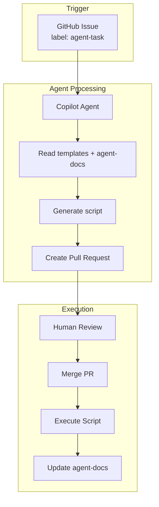

# System Architecture

## Overview

This system automates IT support tasks by connecting GitHub Issues to an AI agent that creates reviewable scripts.

## Flow

## Components

| Component | Purpose |
|-----------|---------|
| GitHub Issue | Task request from user |
| `agent-task.yml` | Workflow that assigns Copilot to the issue |
| Copilot Agent | Reads context, generates scripts, opens PR |
| `_agent/scripts/pending/` | Where agent places new scripts |
| Human Review | Approve/reject the PR |
| `execute-approved.yml` | Runs scripts after merge |
| `_agent/agent-docs/` | Agent's self-created knowledge base |

## Resources

[Azure - Test group](https://entra.microsoft.com/#view/Microsoft_AAD_IAM/GroupDetailsMenuBlade/~/AssignedApplications/groupId/d456a00e-55b4-4559-a6d9-07d029fe2988/menuId/)

## Security Model

- **No direct execution**: Agent only creates scripts, never runs them
- **Human approval required**: All scripts must pass PR review before execution
- **Isolated execution**: Scripts run in GitHub Actions runner, not production
- **Audit trail**: Git history tracks all changes

## Future Extensions

- Azure DevOps integration (trigger from ADO work items)
- Multi-platform support (Teams, Workday, AWS)
- RAG over internal documentation

