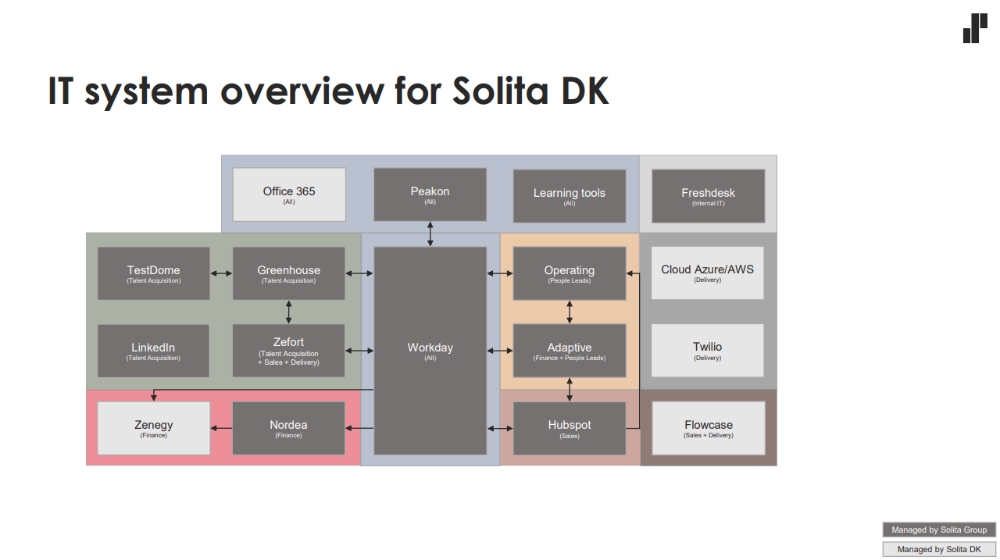

# Platforms overview

[DK internal system overview](https://logisticsas.sharepoint.com/sites/Commentor/Commentor/Forms/AllItems.aspx?viewid=1c289081%2D531c%2D4fd0%2D8f98%2D4f5ae1cb39bc&newTargetListUrl=%2Fsites%2FCommentor%2FCommentor&viewpath=%2Fsites%2FCommentor%2FCommentor%2FForms%2FAllItems%2Easpx&id=%2Fsites%2FCommentor%2FCommentor%2FInformation%2FInternal%20IT%20System%20Overview%2FInternal%20IT%20System%20Overview%2Epdf&parent=%2Fsites%2FCommentor%2FCommentor%2FInformation%2FInternal%20IT%20System%20Overview)

From 17-11-2025

AI agents:
Solitaire / Solita function AI (inhouse developed)
OpenAI api

Main DK systems platforms:
- Cloud Azure/AWS
  - Azure Cloud
  - Azure Devops
  - Entra ID
- SoliTicket
- Office 365
  - Onedrive/Sharepoint
  - Teams

Other DK systems platforms:
- Flowcase (CV'er)
- Bid search
- Twilio

- Zenegy

Finland systems platforms (currently not in scope):
- Workday
- Freshdesk/Freshwork (internal support system)
