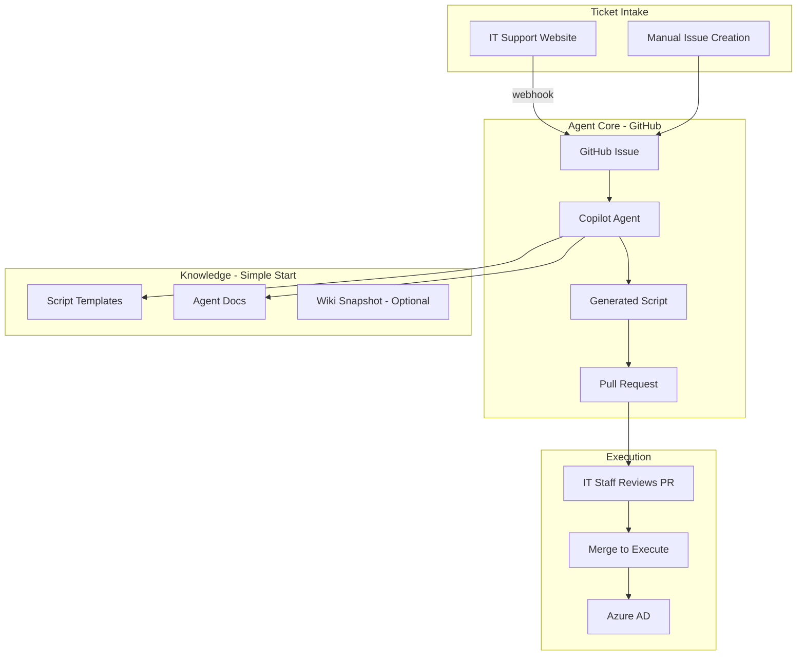
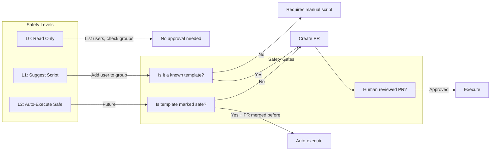

# Early Game: IT Support Copilot MVP

## The 3-Month Thesis Pitch

> "An AI agent that handles 50% of IT support tickets with human supervision, starting with the most common request types."

### Success Criteria

| Metric | Target |
|--------|--------|
| Ticket types covered | 3-5 most common |
| Resolution with only review | 50% of covered types |
| Time from ticket to resolution | < 15 minutes |
| Human approval required | 100% (for thesis safety) |

---

## Scoping the MVP

Based on IT Support handling 10-100 tickets/day, the highest-impact automations:

### Top 5 Most Common IT Ticket Types (Estimated)

1. **Add user to Azure AD group** ← We have this template!
2. **Remove user from group** (offboarding, project changes)
3. **Reset password / unlock account**
4. **Grant access to resource** (SharePoint site, Teams channel, repo)
5. **Create new user / onboarding**

---

## Architecture for MVP

### IN Scope for MVP
- GitHub Issues as ticket intake (webhook from IT website)
- Copilot Agent generates scripts
- Script templates for common tasks
- Human reviews every PR
- Azure AD operations only

### OUT of Scope for MVP (Phase 2+)
- Vector database / RAG over wiki
- Teams bot interface
- Auto-execution without review
- Multi-platform (Workday, M365, etc.)
- Full onboarding automation

---

## Knowledge Strategy

### Option A: No RAG (Simplest) ← Recommended for MVP
- Agent uses only script templates and agent-docs
- Knowledge is "baked in" to the prompts
- Add relevant wiki excerpts manually to agent-docs

**Pros**: Fast to implement, no infrastructure
**Cons**: Agent doesn't know about policies, special cases

### Option B: Simple Wiki Export
- One-time export of ADO wiki to markdown files in repo
- Agent can read these files directly (no vector DB)
- Update manually when wiki changes

**Pros**: Agent has context, still simple
**Cons**: Gets stale, context window limits

### Option C: RAG with Vector DB (Full) ← Save for later
- Set up Azure AI Search or similar
- Index wiki + OneDrive docs
- Agent queries for relevant context

**Pros**: Always current, handles large knowledge base
**Cons**: More infrastructure, 2-3 weeks to set up properly

---

## Safety Architecture

### Safety Rules for MVP

1. **All scripts go through PR** - no exceptions
2. **No delete operations** - only add/modify
3. **Sandbox testing first** - test against IT support subscription
4. **Rollback scripts** - every "add" script has a corresponding "remove"
5. **Audit log** - GitHub history is the audit trail

---

## Open Questions

### 1. IT Website Integration
- Is there a ticket form on the Solita internal IT website?
- What system stores tickets? (ADO work items? Custom DB?)
- Can you add a webhook to it?

### 2. Azure AD Access
- Do you have a test Azure AD tenant or subscription?
- Can you create test users/groups?
- Who grants the Graph API permissions?

### 3. Onboarding Breakdown
What does onboarding a new Solita employee involve?
- [ ] Create Azure AD user
- [ ] Add to standard groups (All Employees, Office-Copenhagen, etc.)
- [ ] Create email/mailbox
- [ ] Add to Teams channels
- [ ] Grant access to SharePoint sites
- [ ] Create ADO account
- [ ] Grant GitHub org access
- [ ] Set up in Workday
- [ ] Order laptop/equipment
- [ ] Other?

Which of these can be done via Azure CLI/Graph API?

---

## Timeline

| Month | Focus |
|-------|-------|
| **Month 1** | MVP working end-to-end for 1 task (add user to group) |
| **Month 2** | Add 2-3 more task types, improve prompts, test with real tickets |
| **Month 3** | Polish, documentation, metrics collection, thesis writing |

---

## Next Concrete Steps

1. **Set up the Azure AD sandbox** - commands to create test users/groups
2. **Create the webhook integration** - connect IT website to GitHub Issues
3. **Expand script templates** - add "remove from group", "list members", etc.
4. **Test Copilot Agent** - figure out how to actually trigger it on issues

