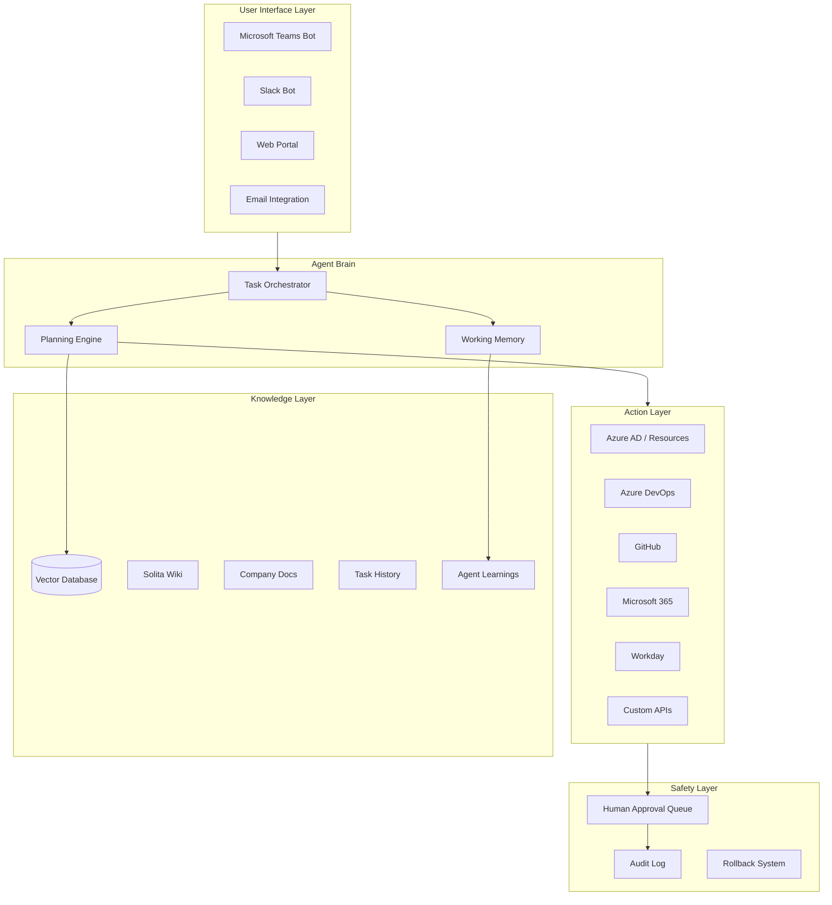

# End Game Vision: Solita Autopilot

## The Vision

Imagine every employee at Solita has a personal AI assistant that:
- **Knows everything** about Solita (wiki, processes, projects, people)
- **Can do things** across all company systems (Azure, ADO, Teams, Workday, etc.)
- **Learns from every interaction** and gets smarter over time
- **Works 24/7** on background tasks while humans focus on creative work

---

## The Architecture (Conceptual)



---

## Key Questions to Answer

### 1. Knowledge Layer

**What does Solita's knowledge look like?**
- Where does your wiki live? (Confluence, SharePoint, Notion, custom?)
- What formats? (Markdown, HTML, PDFs, Word docs?)
- How much content roughly? (100 pages? 10,000?)
- Is there sensitive content that should be excluded?

**Vector DB options:**

| Option | Pros | Cons |
|--------|------|------|
| **Pinecone** | Managed, fast, scales | Cost, external dependency |
| **Weaviate** | Open source, self-hostable | More ops work |
| **Azure AI Search** | Native Azure integration | Azure lock-in |
| **ChromaDB** | Simple, local-first | Less scalable |
| **pgvector** | Just Postgres + extension | DIY embeddings |

### 2. User Interface

**How should people talk to the agent?**
- Teams bot? (Most natural for enterprise)
- GitHub Issues? (Current approach, developer-focused)
- Email? (Low friction, async)
- Dedicated web app? (More control)
- All of the above?

### 3. Action Layer

**What systems should the agent control?**

| System | Read | Write | Example Actions |
|--------|------|-------|-----------------|
| Azure AD | ✅ | ✅ | Add to groups, list users |
| Azure Resources | ✅ | ⚠️ | Create VMs, modify configs |
| Azure DevOps | ✅ | ✅ | Create work items, update boards |
| GitHub | ✅ | ✅ | Create PRs, manage issues |
| Microsoft 365 | ✅ | ⚠️ | Schedule meetings, send emails |
| Workday | ✅ | ❌ | Look up employee info |
| Confluence/Wiki | ✅ | ✅ | Update documentation |

### 4. Safety Model

**How autonomous should the agent be?**

| Level | Description | Example |
|-------|-------------|---------|
| **L0** | Read-only | "Who is in the IT-Support group?" |
| **L1** | Suggest | "Here's a script, want me to run it?" |
| **L2** | Auto-execute safe | Add user to group (reversible) |
| **L3** | Auto-execute risky | Delete resource, remove access |
| **L4** | Full autonomy | Agent decides what needs doing |

---

## Use Cases for Solita

### IT Support Automation
- "Add Maria to the Azure project group and give her access to the dev environment"
- "Set up a new developer with all standard tools and permissions"
- "Offboard this contractor - remove all access"

### Project Management
- "Create a new project in ADO with our standard template"
- "Summarize this week's sprint progress across all my projects"
- "Find all blocked tickets and ping the blockers"

### Knowledge Work
- "What's Solita's policy on remote work?"
- "How do I set up a new customer environment?"
- "Find all documentation about our Kubernetes setup"

### Code & DevOps
- "Update all our repos to use Node 20"
- "Find all deprecated API usages in project X"
- "Create a PR to fix this security vulnerability across all affected repos"

### HR & Admin
- "Who is the manager of the Cloud team?"
- "Book a meeting room for 10 people next Tuesday"
- "Submit my vacation request for next month"

### Analytics & Reporting
- "How many hours did we bill to Project X last month?"
- "What's our Azure spend trend?"
- "Generate the monthly status report for stakeholders"

---

## The Revolutionary Bit

### Today's World

```
Employee has question → Searches wiki → Doesn't find it → Asks colleague → 
Waits for response → Gets partial answer → Does task manually → 
Makes mistake → Fixes it → Documents nothing
```

### Tomorrow's World

```
Employee asks agent → Agent knows the answer OR figures it out → 
Agent does the task → Employee approves → Agent learns for next time
```

### The Compounding Effect

- Every task the agent does, it learns from
- Every question asked, the knowledge base grows
- Every mistake caught, the safety system improves
- **The agent gets exponentially more useful over time**

### The "Cattle Not Pets" Revolution

The idea of "herding cattle" - managing many tickets simultaneously while AI does the work. This fundamentally changes:

1. **Developer productivity**: 10x more tickets processed per day
2. **Response time**: From hours to minutes
3. **Consistency**: Same quality every time
4. **Knowledge preservation**: Institutional knowledge never lost
5. **Onboarding**: New employees have instant access to all tribal knowledge

---

## Questions to Answer

1. **What's the first "wow" demo?** If you could show one thing to Solita leadership, what would blow their minds?

2. **Who are the early adopters?** Which team or department would benefit most from this?

3. **What's the scariest part?** What makes you nervous about giving an AI this much power?

4. **What's already been tried?** Any existing automation or chatbots at Solita we should learn from?

5. **What's the timeline?** Is this a 3-month thesis project or a multi-year product vision?

---

## My Answers

1. Wiki lives in azure devops projekt wikis, and also documents in onedrive. Formats are mostly markdown but also word docs. maybe 100-500 documents. Yes definitely sensitive content.

2. Well we have both a website (Solita internal IT website) and a teams bot, so probably both, but would be easiest to navigate / setup through the website, a teamsbot chat would end up complicated for multiple concurrent agents i think

3. Jep looks pretty good

4. Start at level 0 and then later allow level 1 for confirmed safe template scripts like when a 'add user to group' script has been added as template script, it should be allow for the agent to suggest it. At some point when we are more sure of the agents capabilities and for specific safe scripts (which we can assign as humans) for example add user to group it can use level 2 and auto execute the script.

Questions:
1. I think if the agent could completely onboard a user on every platform based on a prompt from the leadership.
2. Internal IT would benefit the most and should be the focus for the project to start with. They receive 10-100 tickets a day and if the ai agent could solve half of them with only review and supervision from an IT support member that would be great.
3. I am only a student developer and i don't want to risk making any unrevokable changes, like deleting a prod resource for a customer on anything like that.
4. We don't have a lot like this, but in the Solita Finland department they are working on some internal AI agents for repeatable tasks also.
5. For the 3 month thesis project i want to solve IT supports problems. If successful i want to make this a multi year product that can hopefully revolutionize the company.
