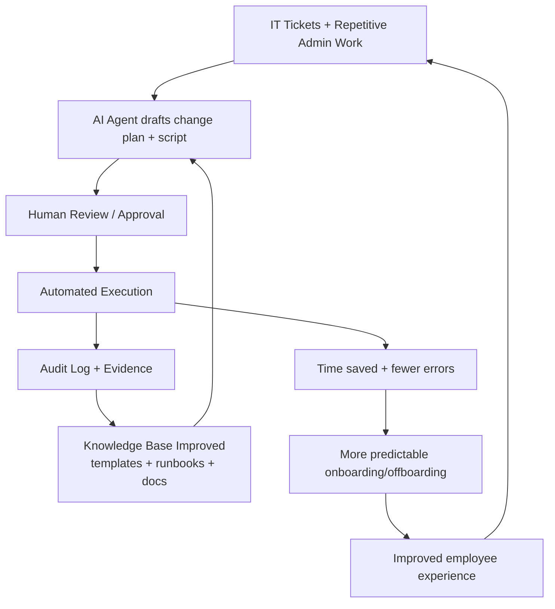
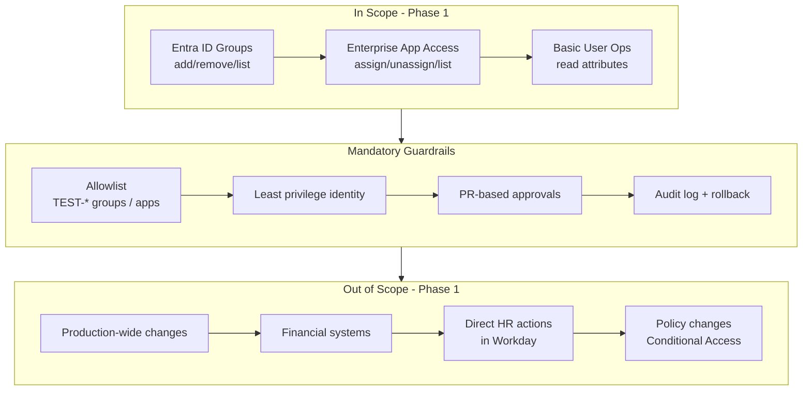
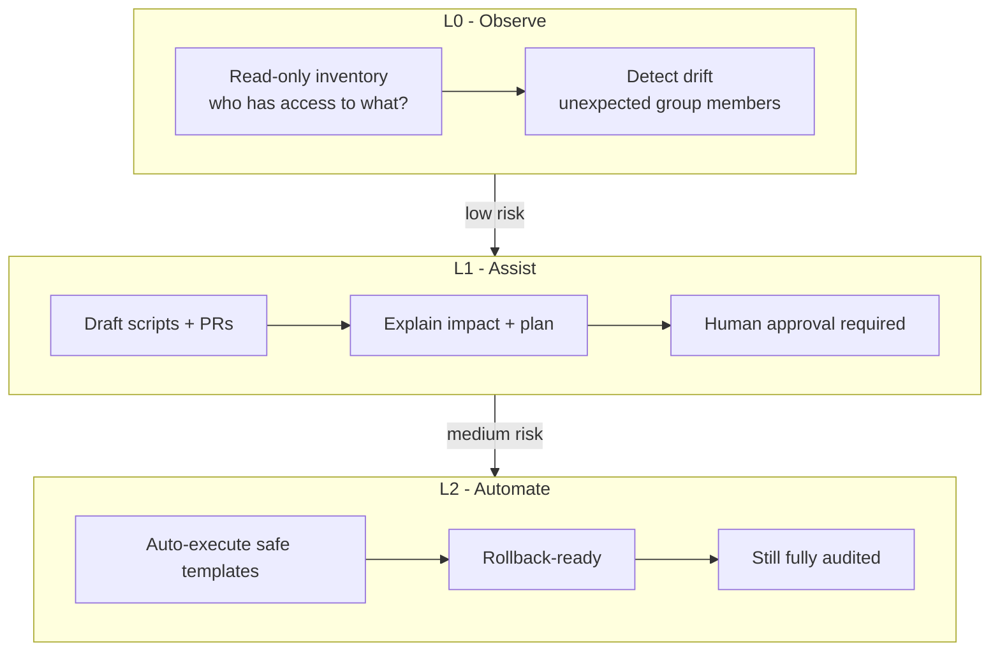
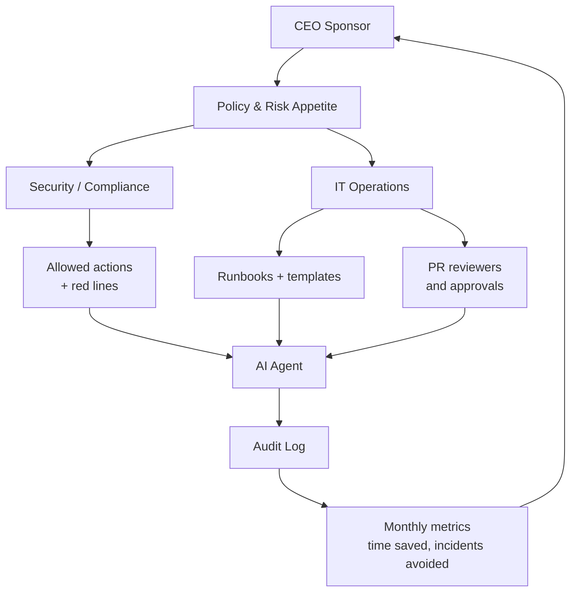
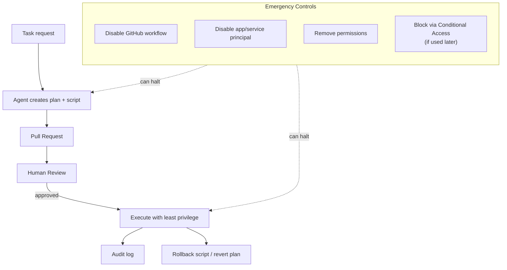
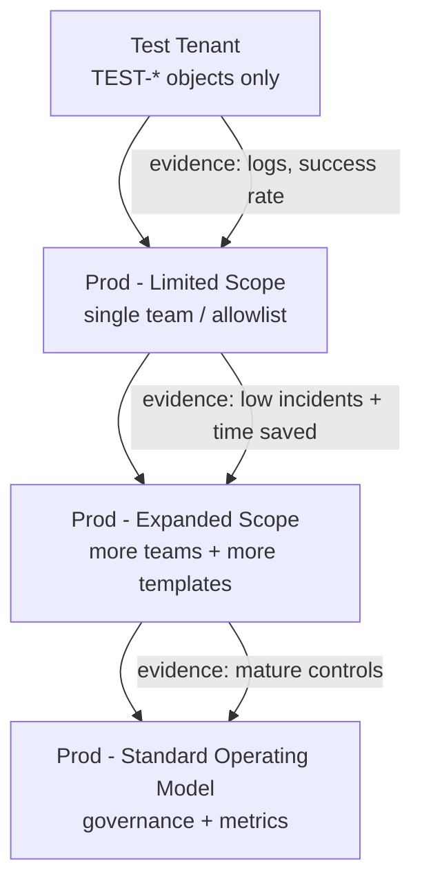
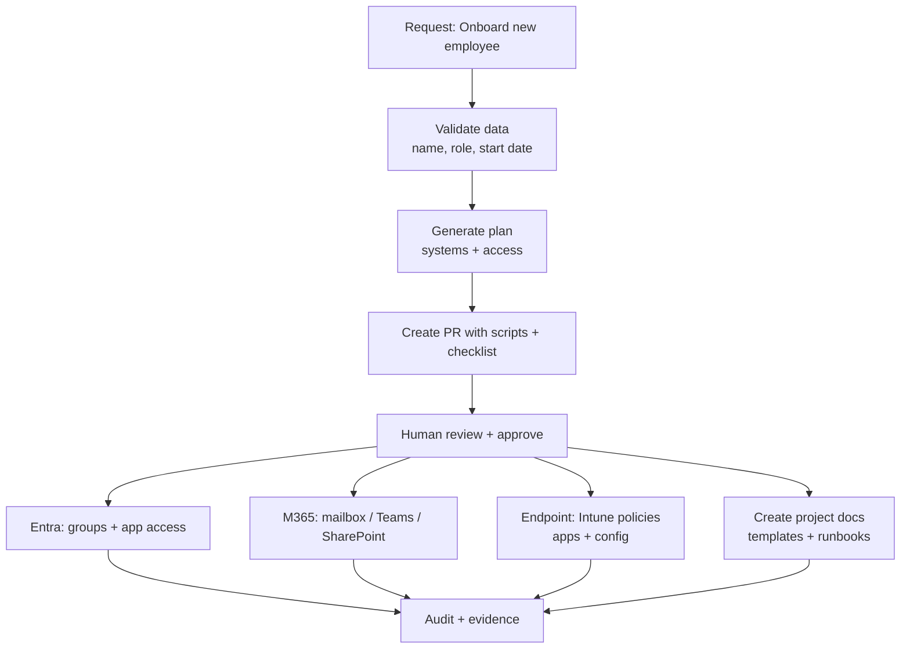
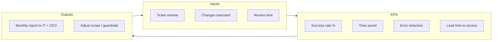

1) "Why this matters" — Business value loop

Shows the project as a flywheel: faster ops → happier people → better delivery.

2) Scope boundary — "What can the agent touch?"

Makes it crystal clear what's in/out (great for trust + risk management).

3) "Read → Suggest → Execute" maturity ladder (with risk)

A clean "roadmap" picture that CEOs love.

4) Governance model — Who owns what?

This is gold in a CEO meeting because it shows you thought about accountability.

5) Safety "kill switch" & containment

Shows you've built a system that can be stopped instantly.

6) Promotion path — Test tenant → Limited prod → Wider prod

Very useful if Jesper asks "how do we safely go from experiment to real value?"

7) Example end-to-end onboarding (multi-system) — future vision

Shows how it becomes a "real thing" beyond Entra groups.

8) Metrics dashboard — "How we prove this works"

CEOs want measurable outcomes. This diagram can justify continued support.

